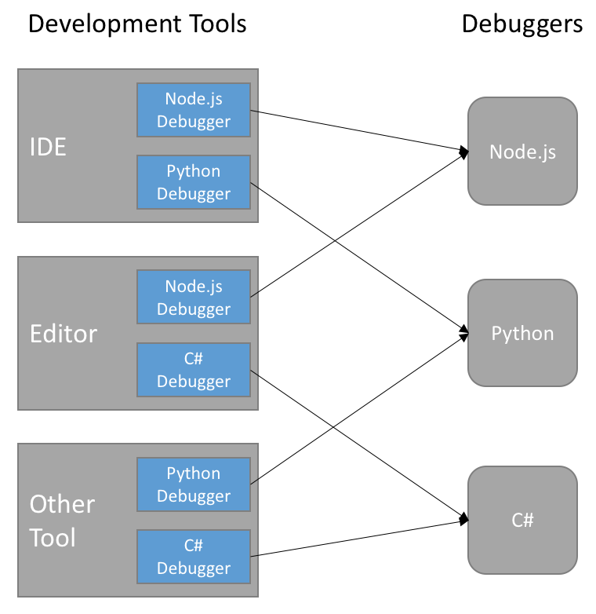

% Remote Debugging Epsilon via DAP
% Antonio Garcia-Dominguez
% ASE seminars - May 29, 2024

# Introduction

## What is Epsilon

* [Eclipse Epsilon](https://eclipse.dev/epsilon/) is a family of scripting languages and tools for model management
* Covers querying, validation, transformation...
* Supports EMF models, XML/CSV/JSON/YAML files, and many other model types

## Ways to run Epsilon

* From Eclipse IDE [launch configurations](https://www.youtube.com/watch?v=_5DCABgHn_4&list=PLRwHao6Ue0YUecg7vEUQTrtySIWwrd_mI&index=3)
* Embedded in an Eclipse plugin
* Embedded in [a Java program](https://eclipse.dev/epsilon/doc/articles/run-epsilon-from-java/)
* From one of the [Epsilon Ant tasks](https://eclipse.dev/epsilon/doc/workflow/)

## Ways to debug Epsilon

* Epsilon 2.5 and older:
  * Only from Eclipse IDE debug configurations
* Epsilon 2.6 and newer:
  * All of the above, using the Microsoft [Debug Adapter Protocol](https://microsoft.github.io/debug-adapter-protocol/overview) (DAP)
* This talk is about how we did it, and how you can use it

# The Microsoft Debug Adapter Protocol

## What is the problem?

{ height=500px }

## What does DAP propose?

{ height=500px }

## How does DAP work?

* Spec mandates a minimum set of interactions for client and server
* Client and server can declare additional optional capabilities
* Messages are JSON-based
* Transport-agnostic: could be over TCP, or just stdin/stdout-based

## Starting a DAP session

{ height=500px }

## Stopping at a breakpoint

{ height=500px }

## DAP implementations

* Clients (see [more](https://microsoft.github.io/debug-adapter-protocol/implementors/tools/)):
  * Microsoft VS Code
  * Eclipse LSP4E
* Servers (see [more](https://microsoft.github.io/debug-adapter-protocol/implementors/adapters/)):
  * [C++ debug adapter](https://github.com/Microsoft/vscode-cpptools)
  * [Java debug adapter](https://github.com/Microsoft/vscode-java-debug)
* SDKs (see [more](https://microsoft.github.io/debug-adapter-protocol/implementors/sdks/)):
  * Using [Node.js](https://github.com/microsoft/vscode-debugadapter-node)
  * Using [Java](https://github.com/eclipse-lsp4j/lsp4j) (Eclipse LSP4J)

# DAP for Epsilon

## Technology choices

* Used Eclipse LSP4J to implement the server side
* Used Eclipse LSP4E as-is for Eclipse-based client
* Minor additions to [Epsilon VS Code extension](https://github.com/Arkaedan/vscode-epsilon/)

## Attach-based adapter

* DAP allows for `launch` and `attach` approaches to debug a program
* Epsilon adapter only supports `attach`ing to a preconfigured script
* Prevents adapter from knowing about all current and future Epsilon languages

## Demonstrations

1. Epsilon embedded in Java (plain files)
1. Epsilon embedded in Java (classpath resources)
1. Epsilon from Ant
1. Epsilon from Gradle in VS Code

# Conclusion

## Results

* Epsilon 2.6.0 now has Microsoft DAP support
* Can debug Epsilon programs wherever they run
* Detailed documentation is on [Epsilon website](https://eclipse.dev/epsilon/doc/articles/debugger/)

## Thank you!

Contact me:

a.garcia-dominguez AT york.ac.uk
